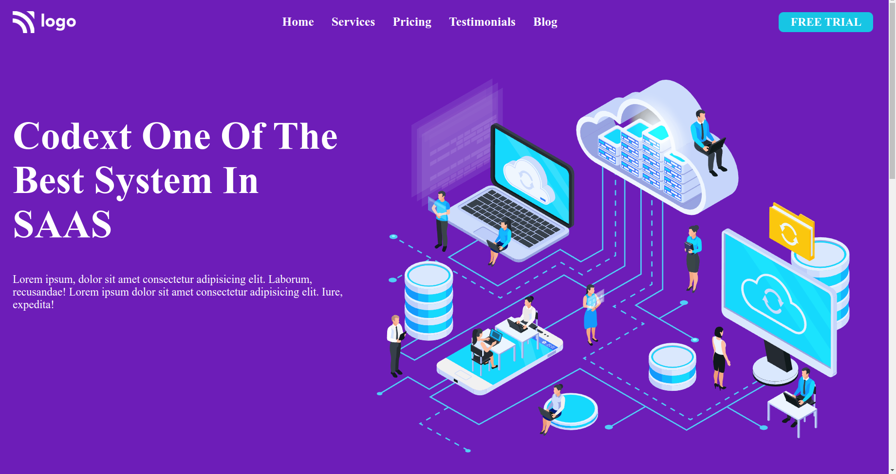
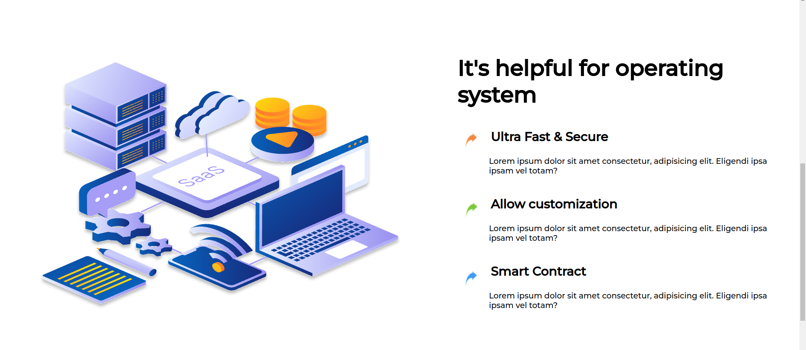
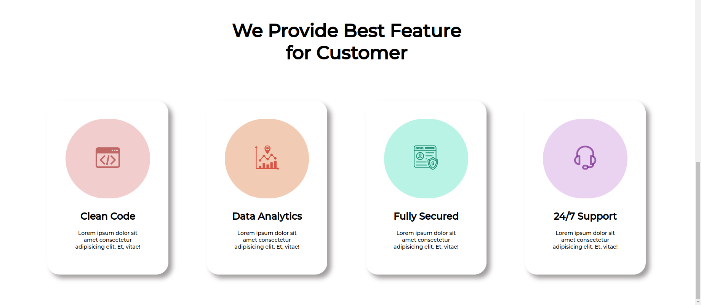

## My Name

### JYOTI SINGH

## PROJECT NAME

### SAAS landing page

## About

- ### Used HTML And CSS.
- ### Style by flex-box .
- ### Responsive.

## WHAT I LEARN FROM THIS PROJECT?

- ### Practicing on Media Query.
- ### Here, i explore on how the font , image, div-container ,cards,etc are changes there own size according the width of the screen size.
- ### 2 times of code-modification done.

# TIME TAKEN TO COMPLETE

- ### First-time it takes 4-5 hour
- ### second-time it takes 5hour modification.

## PHOTOS

### WEBSITE LINK

[Visit Link](https://saas-landing-page-01.netlify.app/)
